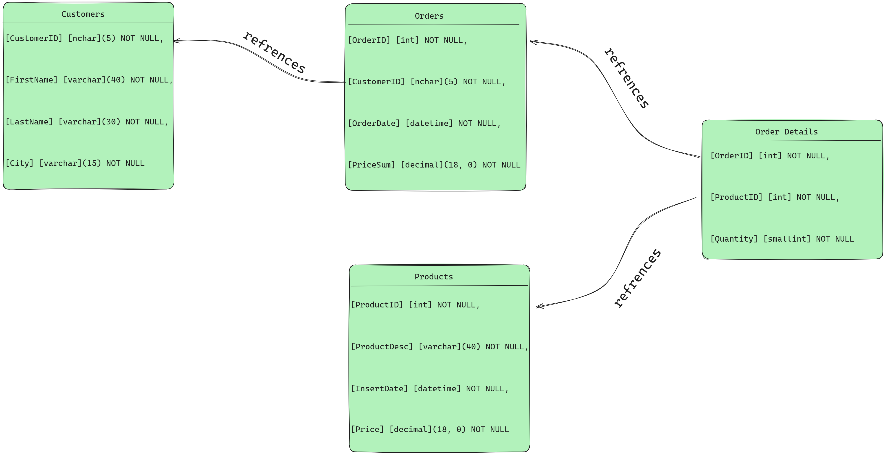

# ShekelTestPart1

Part 1 of the assignment was to analyze this script:
```sql
CREATE DATABASE  [TestDB]
USE [TestDB]
GO


SET ANSI_NULLS ON
GO

SET QUOTED_IDENTIFIER ON
GO

CREATE TABLE [dbo].[Customers](
	[CustomerID] [nchar](5) NOT NULL,
	[FirstName] [varchar](40) NOT NULL,
	[LastName] [varchar](30) NOT NULL,
	[City] [varchar](15) NOT NULL
) ON [PRIMARY]
GO
CREATE TABLE [dbo].[Products](
	[ProductID] [int] NOT NULL,
	[ProductDesc] [varchar](40) NOT NULL,
	[InsertDate] [datetime] NOT NULL,
	[Price] [decimal](18, 0) NOT NULL
) ON [PRIMARY]
GO
CREATE TABLE [dbo].[Orders](
	[OrderID] [int] NOT NULL,
	[CustomerID] [nchar](5) NOT NULL,
	[OrderDate] [datetime] NOT NULL,
	[PriceSum] [decimal](18, 0) NOT NULL
) ON [PRIMARY]
GO

CREATE TABLE [dbo].[Order Details](
	[OrderID] [int] NOT NULL,
	[ProductID] [int] NOT NULL,
	[Quantity] [smallint] NOT NULL
) ON [PRIMARY]
GO
```
Here we create a database with `Customers`, `Products`, `Orders` and `[Order Detail]` table - a mini E-commerce type of situation. The assignment requested a diagram:


We can infer that the `Order Details` table is meant to allow the `Orders` table to reference multiple `Product` rows.

There was also a request to write a query that will get the total quantity bought of each distinct product. Unfortunately I got a solved assignment link, so I decided this was a great time to refresh my `.Net` 
and `SQL` skills, and also prove that will manage working with a Database if I absolutely must.

To do that, I wrote a simple application to measure the turnaround times of two queries that would accomplish this task. So first, I must set up a database. I took some freedom with the given script so that I could add primary keys everywhere (which includes adding a column to the order details table) - it is generally a good idea to have primary keys except for some special situations. More importantly, the keys allowed me to easily work with Entity-Framework, the standard `.Net` ORM. We now have (Assuming the TestDB exists):
```sql
USE [TestDB]
GO


SET ANSI_NULLS ON
GO

SET QUOTED_IDENTIFIER ON
GO

CREATE TABLE [dbo].[Customers](
	[CustomerID] [nchar](5) NOT NULL,
	[FirstName] [varchar](40) NOT NULL,
	[LastName] [varchar](30) NOT NULL,
	[City] [varchar](15) NOT NULL
	PRIMARY KEY (CustomerID)
) ON [PRIMARY]
GO
CREATE TABLE [dbo].[Products](
	[ProductID] [int] NOT NULL,
	[ProductDesc] [varchar](40) NOT NULL,
	[InsertDate] [datetime] NOT NULL,
	[Price] [decimal](18, 0) NOT NULL
	PRIMARY KEY (ProductID)
) ON [PRIMARY]
GO
CREATE TABLE [dbo].[Orders](
	[OrderID] [int] NOT NULL,
	[CustomerID] [nchar](5) NOT NULL,
	[OrderDate] [datetime] NOT NULL,
	[PriceSum] [decimal](18, 0) NOT NULL
	PRIMARY KEY (OrderID)
) ON [PRIMARY]
GO

CREATE TABLE [dbo].[OrderDetails](
	[OrderDetailsID] [int] NOT NULL,
	[OrderID] [int] NOT NULL,
	[ProductID] [int] NOT NULL,
	[Quantity] [smallint] NOT NULL
	PRIMARY KEY (OrderDetailsID)
) ON [PRIMARY]
GO
```

Next, we need to create some software that will add dummy data to the DB - mostly done through the Populator class. 
And now, our queries:

The first query left joins the Products on the Order details, groups by product and sums the quantity. Notice that the grouping now needs to granulate by ProductDesc (so that a single value appears in each group). this is fine as long as ProductID is a primary key, forcing it to be unique (specifically, "more unique" than ProductDesc).
```sql
SELECT 
    P.ProductID,
    P.ProductDesc,
    ISNULL(SUM(OD.Quantity), 0) AS TotalQuantityBought
FROM 
    dbo.Products P
LEFT JOIN 
    dbo.OrderDetails OD ON P.ProductID = OD.ProductID
GROUP BY 
    P.ProductID, P.ProductDesc;
```
The second query uses a sub query to first collect groups of OrderDetails by ProductID, left join the products on these groups, and then gets the datails from the joined table. This means that grouping by ProductDesc is no longer necessary. It would also persumably be slightly faster as we should get a "smaller joined table", because we join on the already grouped OrderDetails.
```sql
SELECT 
    P.ProductID,
    P.ProductDesc,
    ISNULL(Q.TotalQuantityBought, 0) AS TotalQuantityBought
FROM 
    dbo.Products P
LEFT JOIN 
(
    SELECT 
        ProductID,
        SUM(Quantity) AS TotalQuantityBought
    FROM 
        dbo.OrderDetails
    GROUP BY 
        ProductID
) Q ON P.ProductID = Q.ProductID;
```
Running the benchmark (with the parameters that I pushed in the `ShekelTestPart1/Properties/launchSettings.json` file) has pretty consistenly disproven my ambitious assumptions about query speed.
```
results on approach 1:
    avg: 00:00:00.1167187    max: 00:00:00.1274228    min: 00:00:00.1108639
results on approach 2:
    avg: 00:00:00.1258801    max: 00:00:00.1549248    min: 00:00:00.1177030

results on approach 1:
    avg: 00:00:00.1268414    max: 00:00:00.1367713    min: 00:00:00.1209689
results on approach 2:
    avg: 00:00:00.1306104    max: 00:00:00.1354553    min: 00:00:00.1262685

results on approach 1:
    avg: 00:00:00.1343486    max: 00:00:00.1569341    min: 00:00:00.1266824
results on approach 2:
    avg: 00:00:00.1404764    max: 00:00:00.1590315    min: 00:00:00.1321841
```
This could mean:
1. A software bug, since I ran almost 0 tests in this project.
2. I have no idea how the SQLServer internals work.
3. Something else that I'm completely missing.

It will be safe (and probably correct) to assume all three.
\
\
\
\
Notes on running the benchmark:

This program uses an already existing TestDB setup on localhost. You can find a hard-coded connection string in the `OnConfiguring` method in the `ShekelTestEntityModel` class source - I wasn't going to pretend that I'm configuring a secure application (as you will see, the connection string uses `Integrated Security` and does not actually hold any secrets). At any rate, the updated `SQL` script and the location of the connection string should be enough to easily set up a mock database that this program can handle.
